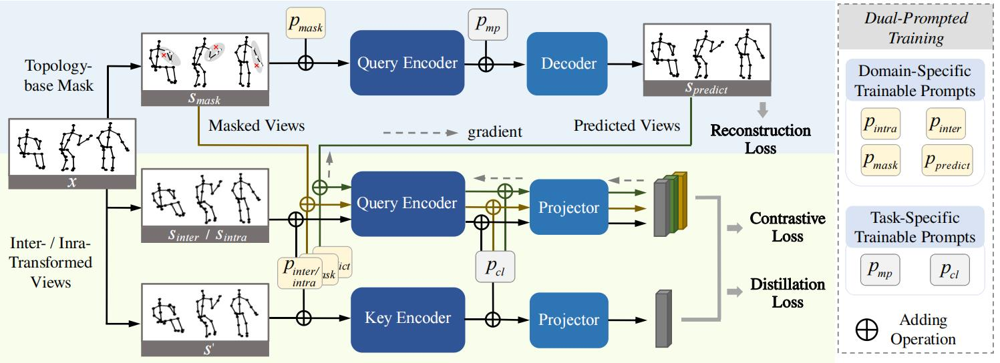

# Prompted Contrast with Masked Motion Modeling: Towards Versatile 3D Action Representation Learning

### Accepted by **ACM MM 2023**. [[Paper Link]](https://arxiv.org/abs/2308.03975) [[Project Link]](https://jhang2020.github.io/Projects/PCM3/PCM3.html)



## Abstract
Self-supervised learning has proved effective for skeleton-based human action understanding, which is an important yet challenging topic. Previous works mainly rely on contrastive learning or masked motion modeling paradigm to model the skeleton relations. However, the sequence-level and joint-level representation learning cannot be effectively and simultaneously handled by these methods. As a result, the learned representations fail to generalize to different downstream tasks. Moreover, combining these two paradigms in a naive manner leaves the synergy between them untapped and can lead to interference in training. To address these problems, we propose Prompted Contrast with Masked Motion Modeling, PCM3, for versatile 3D action representation learning. Our method integrates the contrastive learning and masked prediction tasks in a mutually beneficial manner, which substantially boosts the generalization capacity for various downstream tasks. Specifically, masked prediction provides novel training views for contrastive learning, which in turn guides the masked prediction training with high-level semantic information. Moreover, we propose a dual-prompted multi-task pretraining strategy, which further improves model representations by reducing the interference caused by learning the two different pretext tasks. Extensive experiments on five downstream tasks under three large-scale datasets are conducted, demonstrating the superior generalization capacity of PCM3 compared to the state-of-the-art works.

## Requirements

```bash
python==3.8.13
torch==1.9.0+cu111
```

## Training and Testing
Train on NTU 60-Xview:
```
CUDA_VISIBLE_DEVICES=0 python pretrain_moco_mask.py --lr 0.02 --batch-size 128 --teacher-t 0.05 --student-t 0.1 --topk 16384 --mlp --contrast-t 0.07 --contrast-k 16384 --checkpoint-path mask_checkpoints/PCM3_wprompt --schedule 351 --epochs 451 --pre-dataset ntu60 --skeleton-representation graph-based --protocol cross_view --exp-descri PCM3_wprompt
```
Test on linear action classification:
```
CUDA_VISIBLE_DEVICES=1 python action_classification.py   --lr 0.1 --pretrained xxx_path --finetune-dataset ntu60 --protocol cross_view --finetune-skeleton-representation graph-based
```
More streams can refer to **script_pretrain_moco.sh**.

## Pretrained Models
NTU-60 and NTU-120: To release soon.

## Citation
If you find this work useful for your research, please consider citing our work:
```
@inproceedings{zhang2023prompted,
  title={Prompted Contrast with Masked Motion Modeling: Towards Versatile 3D Action Representation Learning},
  author={Zhang, Jiahang and Lin, Lilang and Liu, Jiaying},
  booktitle={Proceedings of the 31st ACM International Conference on Multimedia},
  pages={7175--7183},
  year={2023}
}
```
TODO
- [ ] downstream task evaluation
- [ ] release pretrained models

## Acknowledgment
The framework of our code is based on [skeleton-contrast](https://github.com/fmthoker/skeleton-contrast).
